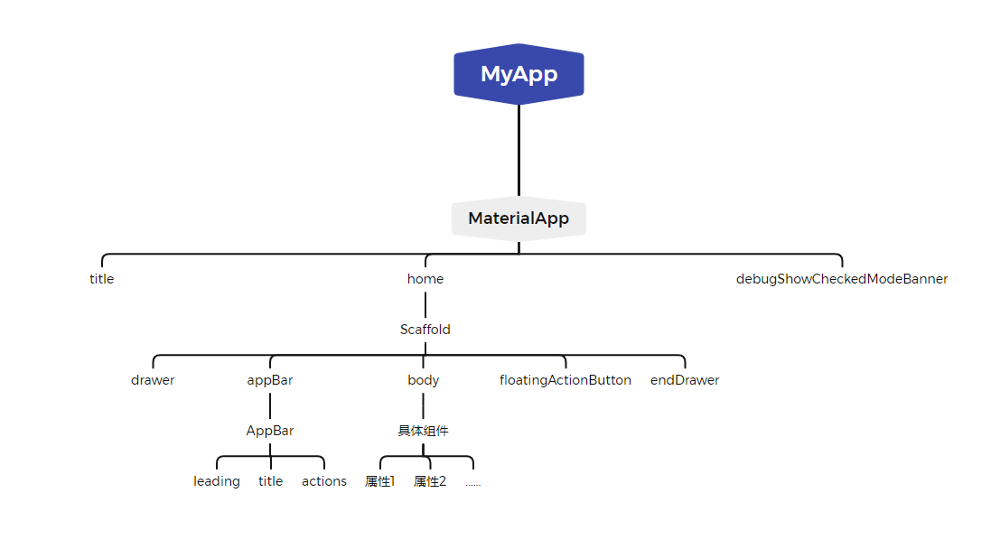
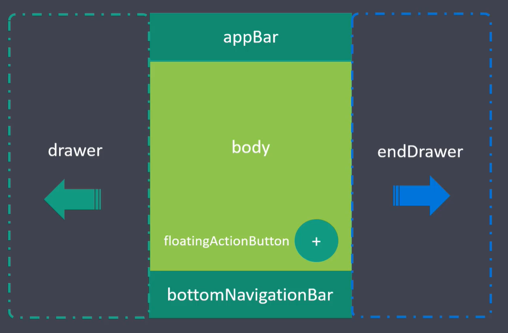

# App 结构

1. MaterialApp
   1. title(任务管理器中的标题)
   2. home(主内容)
   3. debugShowCheckedModeBanner(是否显示左上角的调试标记)
2. Scaffold
   1. appBar(应用头部)
   2. body(应用主体)
   3. floatingActionButton(浮动按钮)
   4. drawer(左侧抽屉菜单)
   5. endDrawer(右侧抽屉菜单)
   6. 